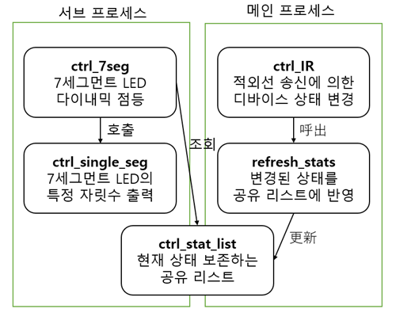

# 적외선 센서를 사용한 사용한 자동제어 시스템

## 사용 주요 부품

1. 라즈베리 파이 4B
2. NPN 트랜지스터 DTC143E
3. 7세그먼트 디코더 74HC4511
4. 7세그먼트 LED OSL40562-LR
5. 온도 모듈 ADT7410
6. 5mm 940nm 적외선 LED
7. 38kHz 적외선 수신 모듈

# 주의할 점

코드의 `sys_ctrl` 클래스 안의 `ctrl_IR` 함수에 본인이 가진 가전제품의 리모컨 RAW 값을 넣어야 올바르게 작동함.

[IRrecord](https://www.lirc.org/html/irrecord.html) 를 통해 적외선 수신 모듈로 리모컨의 각 버튼별 RAW 데이터를 읽어올 수 있음.

단, 에어컨 리모컨의 경우 현재 리모컨의 상태 전체를 송신하는 경우가 대부분이므로 주의를 요함.

또한, IR 송신기를 그대로 사용하면 출력이 너무 약하므로 NPN 트랜지스터를 넣어 신호를 증폭해야 함.

# 구현 기능

TV, 에어컨, 전등의 조작 가능하며, 각 기기의 상태는 7seg 디스플레이에 표시됨.

## 버튼의 조작에 따른 수동 동작

버튼으로 조명을 조작하는 예시

## 시간에 따른 자동 동작

일정 시간(오전 8시)이 되었을 때 TV와 전등을 켜는 모습의 예시

## 실내 온도에 따른 자동 동작

손으로 온도 센서를 잡아 섭씨 30도를 초과하자 에어컨이 가동되는 모습의 예시

# 주요 사용 라이브러리

1. 적외선 통신을 이용한 lirc 라이브러리
2. 멀티프로세싱 관련 라이브러리

